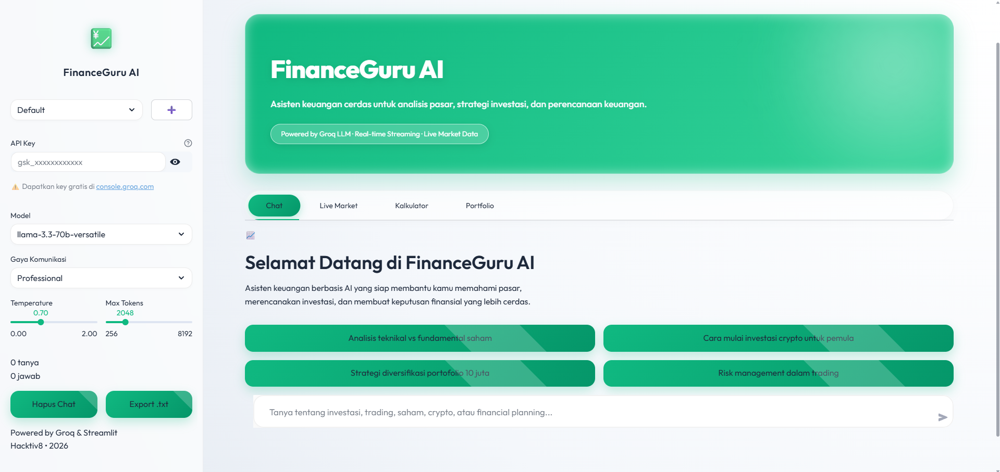
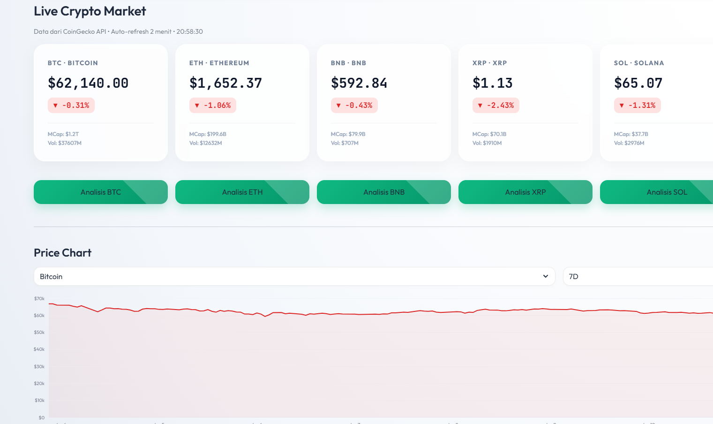
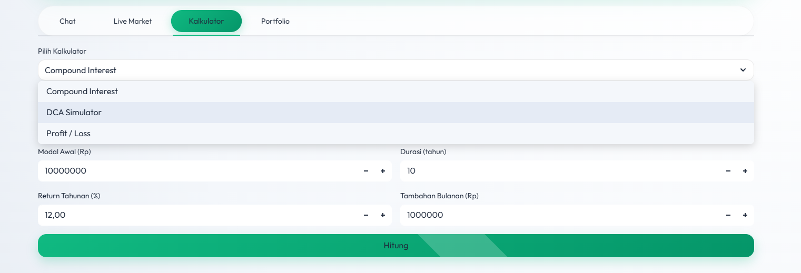
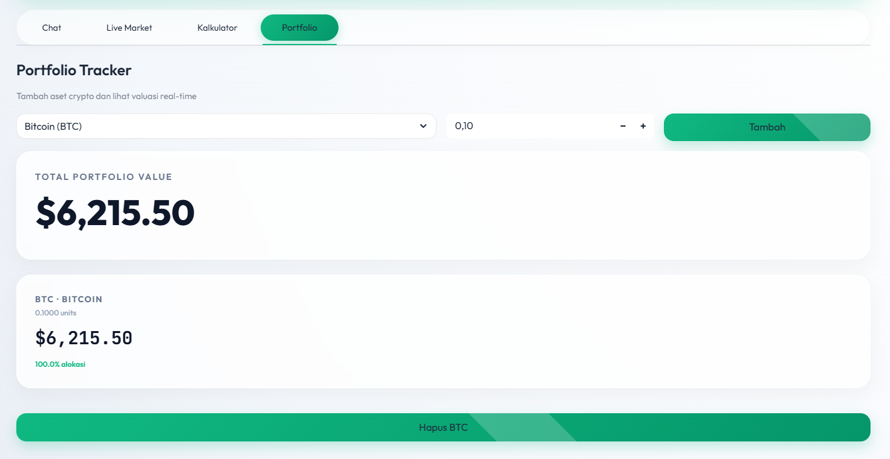

<div align="center">
  
# 💹 FINANCE GURU AI

<a href="https://github.com/HyLuthfi"></a>

  <p align="center">
    <a href="https://finance-guru-ai.streamlit.app/"></a>
  </p>

  <p align="center">
    
    
    
    
  </p>

  <p align="center">
    Asisten keuangan cerdas dan platform dasbor analitik untuk mengoptimalkan perencanaan investasi dan pemantauan pasar kripto. Menggunakan integrasi <b>Groq LLM</b> untuk insight cerdas dengan antarmuka <i>Premium Glassmorphism Dashboard</i>.
  </p>
</div>

<p align="center"></p>

## ✨ Fitur Utama

<table align="center" width="100%">
  <tr>
    <td width="50%" valign="top">
      <b>Intelligent LLM Assistant</b><br/>
      Integrasi Groq API dengan Multi-Session State, Context-Aware AI (mampu membaca isi portofolio), dan Persona Customization.
    </td>
    <td width="50%" valign="top">
      <b>Live Market Dashboard</b><br/>
      Pemantauan aset kripto <i>real-time</i> dengan visualisasi interaktif via Plotly dan metrik Global Sentiment (Fear & Greed Index).
    </td>
  </tr>
  <tr>
    <td width="50%" valign="top">
      <b>Financial Simulator Suite</b><br/>
      Kalkulator presisi tinggi untuk komputasi <i>Compound Interest</i>, Simulasi DCA (Dollar Cost Averaging), dan estimasi Profit/Loss.
    </td>
    <td width="50%" valign="top">
      <b>Dynamic Portfolio Tracker</b><br/>
      Manajemen alokasi aset kripto secara dinamis dengan pembaruan valuasi <i>real-time</i> berbasis integrasi CoinGecko API.
    </td>
  </tr>
</table>

<p align="center"></p>

## 📸 Antarmuka Sistem (Premium Dashboard)

<table align="center" width="100%">
  <tr>
    <td width="50%" align="center">
      <b>Intelligent Chat Assistant</b><br/>
      
    </td>
    <td width="50%" align="center">
      <b>Live Crypto Market & Charts</b><br/>
      
    </td>
  </tr>
  <tr>
    <td width="50%" align="center" valign="middle">
      <b>Financial Calculators</b><br/>
      
    </td>
    <td width="50%" align="center" valign="middle">
      <b>Portfolio Tracking</b><br/>
      
    </td>
  </tr>
</table>

<p align="center"></p>

## 🧮 Arsitektur Sistem & Integrasi

Sistem mengeksekusi pengambilan data asinkron dan integrasi AI secara terstruktur pada tingkat *backend*:

**Integrasi Eksternal (API Metrics):**

- **Groq API (LLM)** - Pemrosesan analitik teks berkecepatan tinggi menggunakan model canggih (Llama 3.3/Gemma 2).
- **CoinGecko API** - Pengambilan data pasar absolut (harga, volume, kapitalisasi, historis).
- **Alternative.me** - Penyedia data indeks sentimen pasar global.

**Implementasi Arsitektur:**

1. **Context-Aware Prompting:** Menggabungkan data pasar aktual dan status kepemilikan portofolio pengguna langsung ke dalam injeksi <i>system prompt</i> untuk menghasilkan analisis AI yang sangat spesifik.
2. **Modular View-Controller:** Menggunakan arsitektur <i>decoupled</i> memisahkan komponen antarmuka (<code>components/</code>), penanganan komunikasi eksternal (<code>utils/api_handler.py</code>), dan injeksi estetika CSS kustom (<code>assets/style.css</code>).

<p align="center"></p>

## 🚀 Panduan Instalasi & Eksekusi

Aplikasi ini menggunakan Streamlit dan sangat mudah dikonfigurasi untuk berjalan di <i>Localhost</i>.

### Tahap Persiapan & Eksekusi

1. **Clone Repositori**
   ```bash
   git clone https://github.com/HyLuthfi/finance-guru-ai.git
   cd finance-guru-ai
   ```
2. **Install Dependensi**
   ```bash
   pip install -r requirements.txt
   ```
3. **Jalankan Server Streamlit**
   ```bash
   streamlit run app.py
   ```
4. **Setup Kunci API (API Key)**
   - Buka browser di `http://localhost:8501`.
   - Dapatkan API Key secara gratis di [console.groq.com](https://console.groq.com).
   - Masukkan kunci tersebut ke dalam bilah samping (<i>sidebar</i>) konfigurasi aplikasi untuk mengaktifkan fitur analisis AI.

<p align="center">
  
</p>
